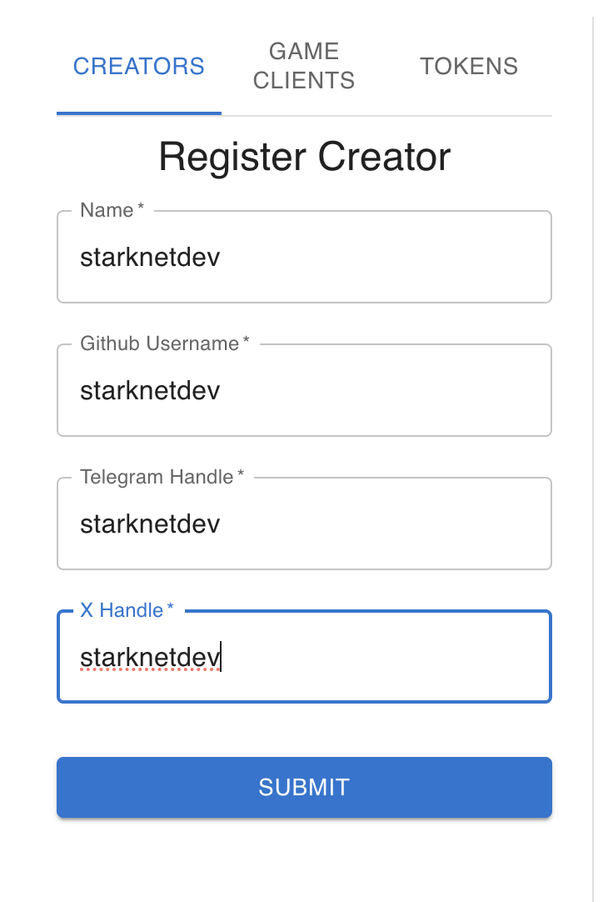
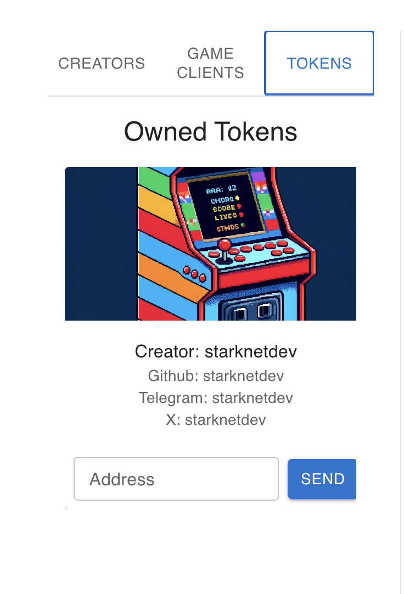
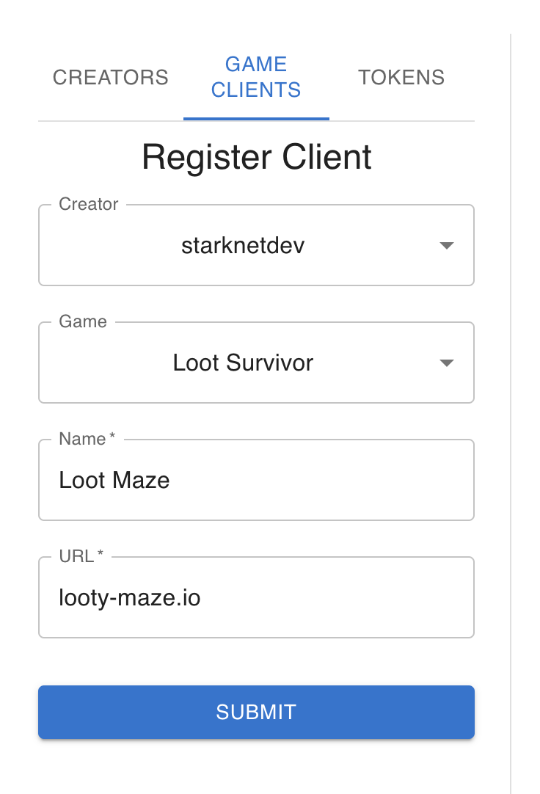
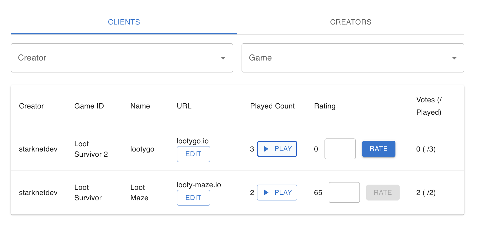

# Client Registration Component

## Functionality

A creator receives an NFT on registering which is used for authentication and streaming of the game client rewards. The client registration component allows the creator to register multiple game clients, as well as linking these multiple games. We keep track of how many times a player has played a particular game client, only allowing them to rate it per number of times played. An overall rating is tracked as well as player average ratings.

We believe this a big step towards FOCG with fully headless clients. A client manager that brings together all components can provide a decentralised service to provide access and community tracking of games as soon as they deploy.

## Demo Manager UI

There is a prototype front end for a client manager provided in this repo to showcase the features of the components.
<p align="left">




</p>

### Setup

Deploy the DOJO Client Manager Contract

```
cd contracts
sozo build
katana --disable-fee
sozo migrate apply
./scripts/auth.sh // authorisation for models (update client manager address)
tori --world <WORLD_ADDRESS> --allowed-origins "*"
```

Run the UI in dev mode

```
cd .. & cd ui
bun run dev
```
